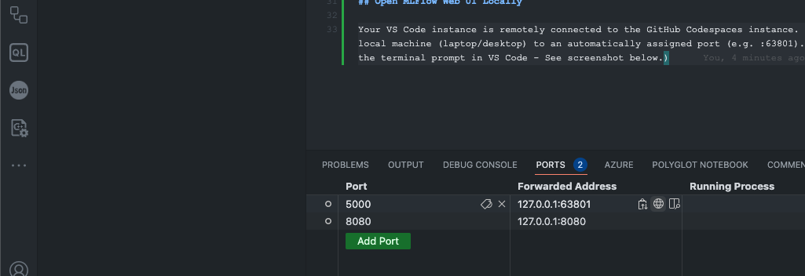

# MLFlow with GitHub Codespaces

## Requirements
- GitHub account
- Visual Studio Code

## Starter Usage:

As a starter use case, you can use Codespaces as a remote compute environment however the experience will feel as if it were local.

### Commands

In a terminal:
```bash
# Start MLFlow UI/Server with default settings set to local by default
mlflow ui
```

In a second terminal:
```bash
# You will need to specify your MLFlow Tracking Server URI/URL
# Since this is "local" you won't need to setup HTTPS

export MLFLOW_TRACKING_URI="http://127.0.0.1:5000"

# mlflow run <mlflow project path/uri>
# example:
mlflow run https://github.com/mlflow/mlflow-example.git
```

## Open MLFlow Web UI Locally

Your VS Code instance is remotely connected to the GitHub Codespaces instance.  The devcontainer has already been preconfigured to port-forward the Codespaces' "local" port of :5000 to your (actual) local machine (laptop/desktop) to an automatically assigned port (e.g. :63801).  To find this and to manually launch your default browser you can find the "PORTS" tab in VS Code (typically found above the terminal prompt in VS Code - See screenshot below).  Beside the listed PORT Mapping (e.g. 5000) you will also see a small globe icon which will help auto launch your default web browser and load the MLFlow web UI.




## Using Azure ML as a remote MLFlow Tracking Server

Now it's time to use a remote MLFlow tracking server instead of using a "local" GitHub Codespaces environment as your tracking and model registry server.  This allows you to run codespaces to write your models/code but have a longer lived centrally managed service for your entire team to leverage.

In this example we will connect to an instance of Azure Machine Learning (AzureML), which has an AzureML workspace deployed to it.  We can then use AzureML Studio to view the jobs that have been run, similar to the MLFlow UI.  The additional benefit here is that we don't have to manage the underlying server that this is deployed to (apply updates to the UI server) and it has an out of the box Identity Provider (i.e. Microsoft Entra - the artist formerly known as Azure Active Directory).

The current deployment is setup for public internet facing access, meaning it is not in a Private VNET access only mode.  In many advanced environments and Enterprise configurations you may be required to deploy your AzureML instance in a Private Virtual Network (VNET) to allow only access to AzureML from resources connected to your Private VNET.  There is also a mixed mode as well.  Please consult a networking specialist in your organization about networking requirements and/or an Azure Specialist to help you determine your company's needs.

This section presumes you have:
- An AzureML instance provisioned with Public Internet Facing Network access (can be reached from public internet)
- Have created an Azure Service Principal (SPN) that is used to connect to AzureML
- Have setup the correct the IAM/RBAC permissions for the SPN (e.g. "AzureML Data Scientist" or "Contributor") Scoped to the Resource Group or AzureML instance, to allow access to AzureML and potentially create resources
- Have added the Codespaces Secrets or Repo Level Secrets for:
    - AZURE_CLIENT_ID
    - AZURE_CLIENT_SECRET (or certificate)
    - AZURE_TENANT_ID
    - AZURE_SUBSCRIPTION_ID
    - AML_WORKSPACE_NAME
    - RESOURCE_GROUP_NAME (where the AzureML instance is deployed to)
    - LOCATION (where the AzureML instance is deployed to)

If you run into errors double check that you have created the secrets in your own GitHub settings and that the environment variables match the secret names entered.  GitHub Secret Names passed into Codespaces are all capitalized in the environment.

```bash
# install required packages to use Azure ML
# azure-ai-ml is the lastest version to integrate AzureML with MLFLow
# azure-mlflow is required to use AzureML as a Model Registry
# https://learn.microsoft.com/en-us/azure/machine-learning/how-to-use-mlflow-configure-tracking?view=azureml-api-2&tabs=cli%2Cenviron
pip install azure-ai-ml azureml-mlflow

# Environment variables are needed via Codespaces secrets or Repo Secrets
#
# AZURE_CLIENT_ID, AZURE_CLIENT_SECRET (or certificate), AZURE_TENANT_ID, $AZURE_SUBSCRIPTION_ID, $LOCATION, $RESOURCE_GROUP_NAME
# NOTE: $LOCATION and $RESOURCE_GROUP_NAME should match the values where your AzureML Instance is deployed to

## Use the following to login in with the provide Azure Service Principal passed in from GitHub Codespaces or Repo level Secrets
## You may also login with your own credentials
az login --service-principal -u $AZURE_CLIENT_ID -p $AZURE_CLIENT_SECRET --tenant $AZURE_TENANT_ID
az account set --subscription $AZURE_SUBSCRIPTION_ID
az configure --defaults workspace=$AML_WORKSPACE_NAME group=$RESOURCE_GROUP_NAME location=$LOCATION

# Get and Set the MLFLOW Tracking URI environment variable
MLFLOW_TRACKING_URI=$(az ml workspace show --query mlflow_tracking_uri | sed 's/"//g')

# Run the sample experiment again
mlflow run https://github.com/mlflow/mlflow-example.git
```

